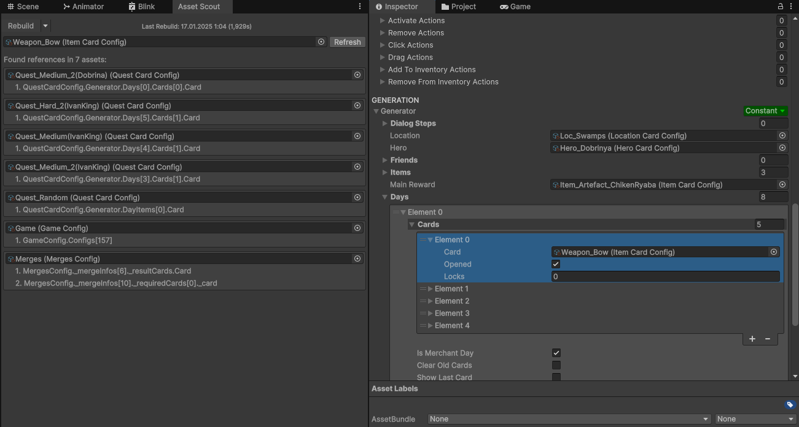

# Asset Scout for Unity

**Please, remove old version Asset Scout before update!**

A powerful Unity Editor tool for finding all references to any asset in your project. Whether you're cleaning up unused assets or refactoring your project, Asset Scout helps you track down every usage of materials, prefabs, scriptable objects, and other Unity assets.

## Features

- **Deep Search**: Finds references in:
  - Scenes
  - Prefabs
  - Scriptable Objects
  - Materials (including shader properties)
  - And other Unity assets
- **Detailed Results**: Shows exact paths to referenced assets
- **Fast & Efficient**: Imidiatly search with rebuilded cache
- **Fast cache**: Rebuild cache with progress tracking (150 seconds for 35000 assets)
- **Easy to Use**: Simple drag & drop interface

## Installation

### Option 1: Unity Package Manager (Recommended)
1. Open the Package Manager window in Unity (Window > Package Manager)
2. Click the "+" button in the top-left corner
3. Select "Add package from git URL..."
4. Enter: `https://github.com/elmortem/assetfinder.git?path=AssetFinder/Assets/AssetScout/Package`

### Option 2: Manual Installation
1. Download this repository
2. Copy the `Packages/AssetFinder` folder to your Unity project's `Packages` folder

## Usage

1. Open the Asset Scout window:
   - Go to `Window > Asset Scout`
2. Drag & drop any asset you want to find references to
3. Click "Find References" or wait for automatic search to begin
4. Review the list of found references:
   - Each entry shows the asset containing references
   - Expand entries to see exact paths where the reference is used

## Dependencies

- **UniTask**: [GitHub Repository](https://github.com/Cysharp/UniTask) - required for asynchronous operations in Asset Scout.

## Requirements

- Unity 2020.3 or later
- .NET Standard 2.0 or later

## License

Free for personal use and indie developers. Commercial licenses available on the Unity Asset Store.
See the [LICENSE](LICENSE) file for full details.

## Support

If you encounter any issues or have questions:
1. Check the [Issues](https://github.com/elmortem/assetfinder/issues) page
2. Create a new issue if your problem isn't already reported
